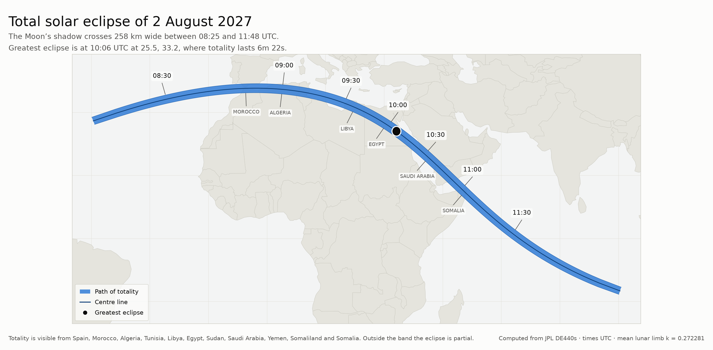
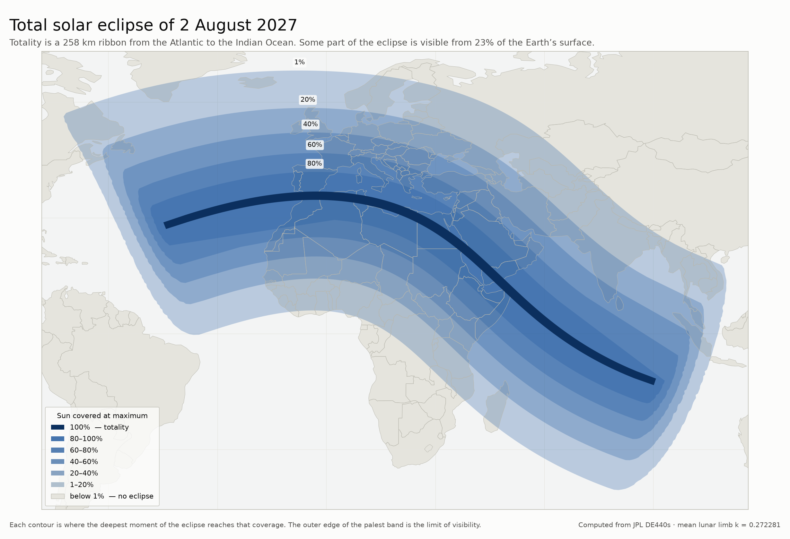

# eclipsepath

Find every solar eclipse in a date range and trace, as latitude/longitude with
timings, the strip of the Earth's surface where the Sun is covered by at least
a given percentage. Output is plain text, JSON, CSV or GeoJSON, so a path can
be dropped straight onto a map.

By default it lists the next ten years of **total** eclipses — a 100% coverage
filter — and draws each path of totality.

```
$ eclipsepath --years 10

Solar eclipses found: 23   (8 reach 100% obscuration)

  Date         Greatest (UTC)  Type      Mag   Cover%   Gamma  Saros   Width      Duration   Greatest eclipse at
  --------------------------------------------------------------------------------------------------------------
  2026-08-12  17:45:57  Total    1.039 100.00%  +0.898   126     293 km    2m18.1s   65.22N, 25.24W
  2027-08-02  10:06:41  Total    1.079 100.00%  +0.142   136     258 km    6m22.4s   25.50N, 33.17E
  2028-07-22  02:55:30  Total    1.056 100.00%  -0.606   146     230 km    5m09.5s   15.58S, 126.69E
  ...

====================================================================================================
2027-08-02  Total solar eclipse  -  path of totality
  eclipse begins 07:30:10 UTC, ends 12:43:12 UTC   saros 136, lunation 341
----------------------------------------------------------------------------------------------------
   Time UTC   Centre line          Northern limit       Southern limit         Width   Duration  Sun
----------------------------------------------------------------------------------------------------
   09:02:14   35.345N    5.214E   36.436N    5.383E   34.255N    5.050E     244 km   5m26.8s   50
   09:44:20   29.891N   25.441E   30.900N   26.082E   28.881N   24.814E     255 km   6m19.0s   75
   10:26:25   20.993N   39.266E   21.873N   40.088E   20.111N   38.455E     259 km   6m13.2s   76
   ...
```

## Install

```
pip install skyfield numpy
```

The JPL ephemeris kernel (`de440s.bsp`, 32 MB, covering 1849–2150) is
downloaded to `~/.eclipsepath/` on first use, or point at an existing copy with
`--kernel`.

## Use

```
eclipsepath                                  # next 10 years of total eclipses
eclipsepath --years 3 --coverage 90          # 3 years, anywhere reaching 90%
eclipsepath --start 2030-01-01 --end 2035-01-01
eclipsepath --format geojson -o paths.geojson
eclipsepath --format csv -o paths.csv
eclipsepath --at 51.48,-3.18                 # what Cardiff sees each time
eclipsepath --all                            # include eclipses below the filter
```

`--coverage` is the percentage of the Sun's **disc area** hidden at the moment
of maximum eclipse (obscuration), not the fraction of its diameter (magnitude).
100% therefore selects total eclipses only: an annular eclipse never covers the
whole disc, so at its very deepest a few percent of the Sun is still showing as
a ring. Annular and hybrid eclipses still have their full antumbral/umbral path
computed — drop the filter to about 85% to bring them in.

### Paths and regions

Two different shapes come out, and which one you get depends on the geometry
rather than on any option:

* A **path** is a strip: a centre line with a northern and a southern limit, a
  width and a duration at each cross-section. The path of totality, or of
  annularity, is always traced for a central eclipse, and it is exactly what
  `--coverage 100` asks for.
* A **region** is a closed outline, given as bearings and distances from the
  deepest point. Coverage areas broaden fast as the threshold drops — the 2026
  Aug 12 eclipse covers 90% of the Sun over a swath 1700 km wide — and below
  roughly 80%, or for any partial eclipse, the area stops being strip-shaped
  at all. Calling its edges "northern and southern limits" would then be
  meaningless, so it is traced as a region instead.

Part of a region's outline is usually the terminator rather than a coverage
contour: past it the Sun has set and coverage drops straight to nothing. Ask
for a coverage threshold on a central eclipse and you get both — the path of
totality or annularity, and the wider region meeting your threshold.

### Tracing a single threshold

`analyse` describes one threshold and picks its own representation.
`coverage_region` traces any threshold as a closed outline regardless, which is
what nesting several of them on a map needs:

```python
from eclipsepath import search, coverage_region

eclipse = search('2027-01-01', years=1)[0]
for threshold in (0.8, 0.6, 0.4, 0.2):
    region = coverage_region(eclipse, threshold, rays=540)
    print(threshold, [(p.latitude, p.longitude) for p in region.points])
```

As a library:

```python
from eclipsepath import search, circumstances_at

for eclipse in search('2026-08-12', years=10, threshold=1.0):
    if not eclipse.meets_threshold:
        continue
    print(eclipse.kind, eclipse.central_duration_seconds)
    for point in eclipse.coverage_band.points:
        print(point.latitude, point.longitude, point.tt_start, point.duration_seconds)
```

### Making a map

`examples/plot_path.py` renders a JSON run as a map image, and is the source of
`examples/eclipse_2027_path.png`.  Every word of the caption is read out of the
JSON, and the projection follows the path: plate carree normally, azimuthal
equidistant about the nearer pole once the path passes 70 degrees, where a
rectangular map would smear it across the whole sheet.  Longitudes are carried
past 180 degrees rather than wrapped, so a path round the far side of the world
stays in one piece:

```
pip install matplotlib
curl -sO https://raw.githubusercontent.com/nvkelso/natural-earth-vector/master/geojson/ne_110m_admin_0_countries.geojson
eclipsepath --start 2027-01-01 --years 1 --samples 400 --format json -o eclipse.json
python3 examples/plot_path.py eclipse.json ne_110m_admin_0_countries.geojson
python3 examples/plot_path.py eclipse.json ne_110m_admin_0_countries.geojson \
    --index 1 -o second.png
```



`examples/plot_coverage.py` draws the same eclipse as nested coverage bands,
using `coverage_region` to trace an outline at each threshold:

```
python3 examples/contours.py            # writes contours.json
python3 examples/plot_coverage.py contours.json ne_110m_admin_0_countries.geojson
```



### GeoJSON

Each eclipse becomes a `greatest-eclipse` point and a `shadow-track` line.
A path adds `centre-line`, `northern-limit` and `southern-limit` lines plus a
filled `band` polygon; a region adds a closed `coverage-region` line, and a
`region-area` polygon when it neither wraps the antimeridian nor reaches over
a pole. Every line feature carries a `times` array parallel to its coordinates.
Geometries are cut where they cross the antimeridian so nothing is drawn the
wrong way round the globe.

## How it works

Rather than the classical Besselian elements, the geometry is solved directly
as vectors, which keeps every quantity defined by what an observer actually
sees.

1. **Positions.** Geocentric astrometric Sun and Moon vectors come from the JPL
   DE440s ephemeris via Skyfield — light-time corrected, so each body sits
   where it was when the light now arriving left it, which is what casting a
   shadow depends on. Aberration and deflection are deliberately not applied:
   they displace both bodies almost identically and cancel in the geometry.
2. **Finding eclipses.** A coarse pass over the range keeps the new moons where
   the shadow axis comes near the Earth; a fine pass then decides whether the
   penumbral cone actually touches the globe and brackets first and last
   contact. Greatest eclipse is the instant the axis passes closest to the
   Earth's centre.
3. **Local circumstances.** For a site, the apparent radii of the two discs and
   their separation give obscuration from the standard circle-overlap area, and
   magnitude from the covered fraction of the diameter. The deepest moment is
   found by golden-section search on the separation — or, for a site that only
   catches the eclipse around sunrise or sunset, at the instant the Sun's centre
   reaches the horizon.
4. **The track.** At each instant the darkest point on the globe is where the
   shadow axis pierces the WGS84 ellipsoid. When the axis misses the Earth
   entirely, as it does throughout a partial eclipse, a pattern search on the
   surface finds the deepest point instead, so the track stays defined.
5. **The area.** What is wanted for a threshold X is `{p : max over t of
   obscuration(p, t) >= X}`. As a path, its edges are found by bisecting
   outwards from the track along the perpendicular to the shadow's motion — the
   perpendicular comes from the shadow's velocity over a two-second baseline,
   since a track passing near a pole can swing tens of degrees in a couple of
   minutes. The path of totality is the same construction under the umbral
   criterion, "the Moon's disc lies wholly inside the Sun's, or wholly contains
   it", which is also what gives an annular eclipse its path. As a region, rays
   are cast from the deepest point of the eclipse and each is bisected for
   where coverage falls through the threshold. Which of the two is used is
   decided from a fixed-size probe, so it never depends on `--samples`.

Inside each eclipse the Sun, Moon and Earth-orientation are modelled by
Chebyshev series fitted to exact values, accurate to under a centimetre for the
Moon and under a millimetre of surface displacement for the rotation. That is
what makes the tens of thousands of evaluations behind the boundary searches
cheap enough to run: a ten-year scan with full paths takes about 50 seconds.

### Constants and conventions

| Quantity | Value | Note |
| --- | --- | --- |
| Ephemeris | JPL DE440s | 1849–2150 |
| Solar radius | 696 000 km | semi-diameter 959.63″ at 1 au |
| Lunar radius | k = 0.2722810 | `--lunar-radius iau` for 0.2725076 |
| Earth | WGS84 ellipsoid | a = 6378.137 km, f = 1/298.257223563 |
| Sun altitude | geometric | no refraction; visibility requires the centre above the horizon |

Two values of k are in use. The IAU (1982) mean lunar radius, k = 0.2725076,
averages over the peaks and valleys of the limb. Espenak adopts a smaller mean
minimum radius, k = 0.2722810, for umbral and antumbral contacts, because the
last of the photosphere shines through lunar valleys and the smaller figure
reproduces observed contact times and path limits better. The smaller value is
the default here, so results line up with published catalogues; it is worth
about 2% on path width and central duration.

## Accuracy

Verified against NASA/Espenak's published tables. `tests/verify_against_nasa.py`
compares full path tables row by row; `tests/test_eclipsepath.py` covers the
Five Millennium Catalog and the geometry itself.

All 25 solar eclipses from 2026 to 2036 are found, each classified correctly as
total, annular, hybrid or partial, with:

| Quantity | Agreement with NASA |
| --- | --- |
| Time of greatest eclipse | within 0.5 s (all 25) |
| Gamma | within 0.0005 |
| Eclipse magnitude | within 0.0006 |
| Position of greatest eclipse | within the catalogue's 1° rounding |
| Central duration | within 0.6 s |
| Saros and lunation number | exact |

Against three published path tables — 2026 Aug 12 (total), 2026 Feb 17
(annular) and 2033 Mar 30 (a near-grazing total, the Sun only 11 degrees up
along a path 780 km wide) — over the body of each path:

| Quantity | Mean | Worst |
| --- | --- | --- |
| Centre line | 0.14 - 0.60 km | 2.0 km |
| Northern limit | 0.54 - 1.00 km | 1.8 km |
| Southern limit | 0.33 - 1.09 km | 1.9 km |
| Path width | 0.45 - 1.08 km | 3.0 km |
| Central duration | 0.07 - 0.09 s | 0.13 s |
| Moon/Sun diameter ratio | exact to the tabulated 3 decimals | |

(ranges span the three eclipses)

The residual kilometre is about what the different ephemerides account for:
those NASA tables were computed with VSOP87/ELP2000-85 rather than DE440.
Independently, Wikipedia's figures for the 2027 Aug 2 eclipse (gamma 0.1421,
magnitude 1.079, 6m23s, 258 km, 25.5°N 33.2°E, saros 136) all reproduce, and
Cardiff's 93.2% at 19:13 BST on 2026 Aug 12 — quoted by timeanddate.com, and
the eclipse this project was written the day of — comes out as 93.24% at
18:13:48 UTC.

### Things worth knowing

* **Path width is a true geodesic distance** between the limits. Catalogue
  widths come from a tangent-plane Besselian formula that under-reports a very
  wide band seen at low Sun altitude: for the 2026 Feb 17 annular the distance
  between NASA's *own* published limits runs 15–26 km wider than the width
  NASA tabulates alongside them, matching the difference seen here.
* **Cross-sections that are not transverse report no width.** Where a track
  meets the terminator the perpendicular runs along the edge of the band rather
  than across it; those rows show `-` instead of a number several times too
  large. Their limit coordinates are still real points on the boundary.
* **A region's outline is traced radially**, which assumes coverage falls away
  from the deepest point along each bearing. That holds for the blob-shaped
  areas regions are used for; long curved swathes are traced as paths instead,
  precisely because a radial sweep would cut their corners.
* **A region's edge is exact except in the grazing zone.** Wherever the Sun is
  properly up, the threshold is met immediately inside the outline and not met
  immediately outside it. Within a degree or so of the horizon peak coverage
  goes nearly flat, so the edge there is only good to a few kilometres — and
  neglected refraction moves the terminator by far more than that regardless.
* **Delta-T limits long-range accuracy.** The difference between Terrestrial
  Time and universal time cannot be predicted years ahead. It does not affect
  TT timings or latitudes, but it slides a path in longitude by about 0.46 km
  per second of error at the equator. Values here come from Skyfield's IERS
  data (69.1 s for 2026, against the 75 s assumed by the 2006-era NASA
  catalogue). Use `--delta-t` to impose a different assumption.
* **The lunar limb is treated as a circle.** Real umbral edges are ragged at
  the kilometre scale because of mountains and valleys, which is what the two
  values of k are trying to average over. Grazing-line observers should use
  limb-profile predictions.
* **No atmospheric refraction**, so a path's extreme sunrise/sunset ends are
  slightly conservative.

## The Moon's real limb

Everything above treats the Moon as a circle. It is not: the edge that cuts off
the Sun is a mountainous horizon whose radius varies by several kilometres with
position angle, and which turns slowly as libration rotates the Moon relative
to us. That is what the two values of k are averaging over.

`--limb` replaces the constant with a profile measured from lunar laser
altimetry — for each position angle, where the limb actually is at that moment.
It needs two extra downloads, both public domain:

```
# LOLA gridded elevation model (531 MB) from the NASA Planetary Data System
curl -sO https://pds-geosciences.wustl.edu/lro/lro-l-lola-3-rdr-v1/lrolol_1xxx/data/lola_gdr/cylindrical/img/ldem_64.img
curl -sO https://pds-geosciences.wustl.edu/lro/lro-l-lola-3-rdr-v1/lrolol_1xxx/data/lola_gdr/cylindrical/img/ldem_64.lbl
# lunar orientation, for libration, from JPL NAIF
curl -sO https://naif.jpl.nasa.gov/pub/naif/generic_kernels/fk/satellites/moon_080317.tf
curl -sO https://naif.jpl.nasa.gov/pub/naif/generic_kernels/pck/pck00011.tpc
curl -sO https://naif.jpl.nasa.gov/pub/naif/generic_kernels/pck/moon_pa_de421_1900-2050.bpc
```

Put them beside the ephemeris and pass `--limb`. It costs no measurable time —
the profile is built once per run and sampled by interpolation.

There is a satisfying check available on it. Espenak's k = 0.272281 is an
*empirical* value, settled on from limb charts and observed contact timings
rather than derived. Averaging a real altimetry profile around the limb, over
eleven eclipses, gives 1736.706 ± 0.060 km. His constant is 1736.646 km — the
two agree to **60 metres**, which is a good sign that the libration, limb
geometry and elevation lookup are all doing what they should.

The effect on results is what the literature would lead you to expect: for the
2027 eclipse the path limits move by a few kilometres, because the northern and
southern limits sample opposite sides of the limb and pick up different terrain,
while the duration on the centre line barely moves.

## Data sources and licensing

Nothing here is copyleft and nothing requires attribution as a condition of use.

| Input | Source | Licence |
| --- | --- | --- |
| Skyfield, jplephem, sgp4 | PyPI | MIT |
| NumPy | PyPI | BSD-3-Clause |
| Matplotlib (examples only) | PyPI | PSF, BSD-compatible |
| certifi (via Skyfield) | PyPI | MPL-2.0 |
| `de440s.bsp` ephemeris | JPL NAIF | US Government work, public domain |
| Lunar orientation kernels | JPL NAIF | US Government work, public domain |
| LOLA elevation model | NASA PDS | US Government work, public domain |
| Country and land outlines | Natural Earth | Public domain, no attribution required |

No data files are bundled; everything above is fetched on first use. The only
third-party content committed to this repository is `tests/data/*.json`, a few
dozen reference values (times, coordinates, widths, durations) transcribed from
NASA's published eclipse tables for verification. Those are measurements rather
than creative work, and they are used only by the test suite.

Physical constants in the source — the solar radius, both lunar radius
conventions, the WGS84 ellipsoid, horizon refraction, the synodic month — are
published standard values. The saros formula in `eclipse.py` was derived here by
fitting the catalogue, not taken from a source.

The colours in `examples/` came from a design reference rather than a public
palette. Individual colours are not copyrightable, but if that matters they are
named constants at the top of each plotting script and are trivial to swap.

## Tests

```
python3 tests/test_eclipsepath.py        # 39 tests, also runs under pytest
python3 tests/verify_against_nasa.py     # row-by-row against NASA path tables
```

The first takes a few minutes: most of it recomputes the whole 2026-2036 scan
and traces real paths rather than mocking any of it.

Set `ECLIPSEPATH_KERNEL` or pass the kernel path to reuse an existing download.

## Sources

* [NASA Five Millennium Catalog of Solar Eclipses](https://eclipse.gsfc.nasa.gov/SEcat5/SE2001-2100.html) — Espenak & Meeus
* [NASA path table, 2026 Aug 12](https://eclipse.gsfc.nasa.gov/SEpath/SEpath2001/SE2026Aug12Tpath.html)
* [NASA path table, 2026 Feb 17](https://eclipse.gsfc.nasa.gov/SEpath/SEpath2001/SE2026Feb17Apath.html)
* [NASA path table, 2033 Mar 30](https://eclipse.gsfc.nasa.gov/SEpath/SEpath2001/SE2033Mar30Tpath.html)
* [Mean lunar radius and the two values of k](https://www.eclipsewise.com/solar/SEhelp/SEradius.html)
* [JPL DE440 ephemeris](https://naif.jpl.nasa.gov/pub/naif/generic_kernels/spk/planets/)
